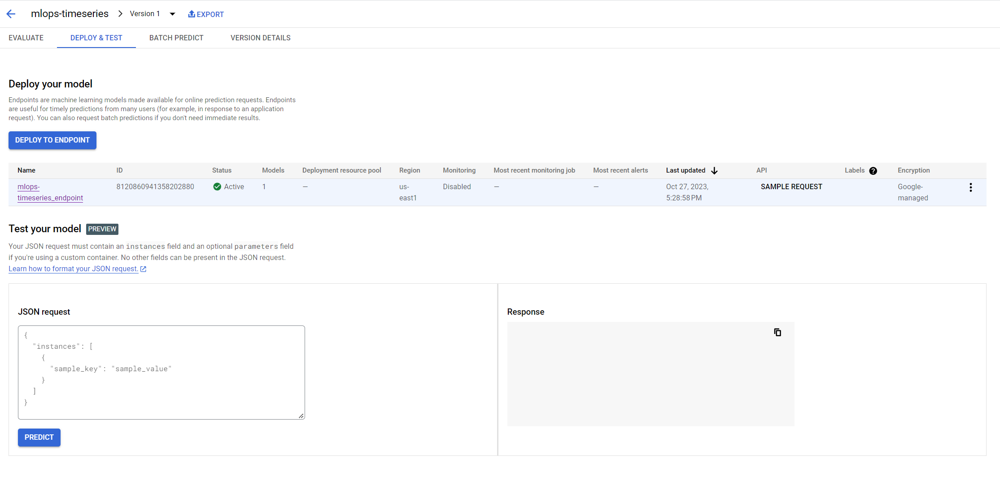

# Timeseries MLOps Project


## Data Source

The dataset used in this project is acquired from the UCI Machine Learning Repository. You can find the dataset [here](https://archive.ics.uci.edu/dataset/360/air+quality).

The data is version controlled using DVC and is split into months and years. All the data transformations and splitting can be found in the `notebooks` folder.

We have two primary DVC files:

- `monthly_data.dvc`: This tracks all the monthly split data.
- `raw_data.dvc`: This tracks the original data acquired from the UCI repository.

The DVC-tracked data is stored on a Google Cloud Bucket.

## Data Preprocessing

**CO(GT)** is the target variable, and the other features are used as predictors. The dataset is split into training and testing subsets. The training data uses the first 2 months of data, and the testing data uses the third month's data.

**Normalization** <br>

To ensure the model's optimal performance, we normalize the data. The normalization statistics, specifically the `mean` and `standard deviation`, are calculated based on the training data. The calculated normalization statistics (mean and standard deviation) are stored in a Google Cloud Bucket.

For maintaining data quality and readiness, [Dataprep by Trifacta](https://cloud.google.com/dataprep) is employed. You can create flows, transform the dataset, and export the processed data seamlessly. It facilitates regular data inspections to handle missing values, and normalizes the data using key statistics. Dataprep also offers scheduling capabilities, allowing for these preprocessing tasks to be automated and run daily, ensuring the datasets used for training are always up-to-date and consistent.

### Creating a Flow in Dataprep by Trifacta

1. **Access Dataprep**: 
   - Open Dataprep by Trifacta in your browser.
   
2. **Start a New Flow**:
   - Navigate to the main dashboard.
   - Click on the "Create Flow" button.

3. **Name Your Flow**:
   - Provide a relevant name and, if desired, a description to help identify the purpose of this flow.

4. **Add Datasets to Your Flow**:
   - Click on "Add Datasets".
   - Choose to import data from various sources (local files, databases, cloud storage, etc.).
   - Once selected, click on "Add" to add them to the flow.

5. **Create Recipes**:
   - Once your dataset is added, click on the dataset's name to view it.
   - Start transforming the data by clicking on "Create Recipe".

6. **Define Transformations**:
   - Use the available transformation commands, functions, and visual tools to manipulate your data.
   - Examples: filtering out rows, splitting columns, changing data formats.

7. **Review and Save**:
   - Review the transformations and click "Save" when satisfied.
   - Preview results to ensure transformations produce the expected outcomes.

8. **Export Processed Data**:
   - After setting transformations, click on "Run Job".
   - On completion, export the results directly to a Google Cloud Bucket.
   - This processed data in the Google Cloud Bucket will be used for training our model.

## Model Training and Building
1. **Folder Structure**:
    - The main directory is `src`.
    - Inside `src`, there are two main folders: `trainer` and `serve`.
    - Each of these folders has their respective Dockerfiles, and they contain the `train.py` and `predict.py` code respectively.
    - There's also a `build.py` script in the main directory for building and deploying the model.
```
src/
|-- trainer/
|   |-- Dockerfile
|   |-- train.py
|-- serve/
|   |-- Dockerfile
|   |-- predict.py
|-- build.py
```

2. **Training Code (`trainer/train.py`):**

- **Imports**: The code begins by importing necessary libraries.
- **Loading Data**: The `load_data()` function retrieves training data from Google Cloud Storage and returns a pandas DataFrame.
- **Data Transformation**: The `data_transform()` function splits the data into training and testing sets. This function also loads a Json file from Google Cloud Storage to normalize the training data.
- **Model Training**: The `train_model()` function sets up and trains a RandomForestRegressor model.
- **Model Saving**: After training, the model is saved to Google Cloud Storage with a unique timestamp as its name for versioning purposes.
- **Docker Environment**: The Dockerfile in the `trainer` folder specifies the environment for training.

3. **Serving Code (`serve/predict.py`):**

- **Setup**: This code sets up a Flask application to serve predictions.
- **Initialization**: Initializes global variables and loads the latest trained model from Google Cloud Storage.
- **Normalization**: The same reference JSON file used in the training phase (loaded from Google Cloud Storage) is utilized to normalize incoming data for prediction, ensuring consistency between training and prediction phases.
- **Health Check**: The `/ping` route checks the health of the application.
- **Prediction**: The `/predict` route receives data, preprocesses it using the normalization parameters derived from the reference dataset, and then returns predictions.
- **Docker Environment**: The Dockerfile in the `serve` folder specifies the environment for serving.


4. **Building and Deploying the Model (`build.py`)**:
    - This script uses Google Cloud's aiplatform library to initialize the Vertex AI setup.
    - It defines the model's display name, container URI, and other deployment parameters.
    - The custom container training job is created, and the model is run and deployed to an endpoint.

In order to build the train and serve images, run the following commands:

**For training image:**<br>
`docker build -t us-east1-docker.pkg.dev/[YOUR_PROJECT_ID]/[FOLDER_NAME]/train:v1 .` <br>
`docker push us-east1-docker.pkg.dev/[YOUR_PROJECT_ID]/[FOLDER_NAME]/train:v1` <br>

**For serving image:**<br>
`docker build -t us-east1-docker.pkg.dev/[YOUR_PROJECT_ID]/[FOLDER_NAME]/serve:v1 .` <br>
`docker push us-east1-docker.pkg.dev/[YOUR_PROJECT_ID]/[FOLDER_NAME]/serve:v1`  <br>

Upon completion, your Docker images for training and serving will be available in the Google Container Registry.
Here, `[YOUR_PROJECT_ID]` and `[FOLDER_NAME]` are placeholders, and you should replace them with their respective Google Cloud project ID and folder name.

The `build.py` script contains several essential configurations for setting up and deploying your model. Here's a breakdown of these configurations and what they represent:


1. **REGION**:
   - Description: Specifies the Google Cloud region where your resources will be allocated and where operations will be performed.
   - Example:
     ```python
     REGION = '[YOUR_REGION]'
     ```
     *Replace `[YOUR_REGION]` with your desired region, e.g., `us-east1`.*

2. **PROJECT_ID**:
   - Description: Your Google Cloud Project ID.
   - Example:
     ```python
     PROJECT_ID = '[YOUR_PROJECT_ID]'
     ```
     *Replace `[YOUR_PROJECT_ID]` with your specific Google Cloud project ID.*

3. **bucket**:
   - Description: The Google Cloud Storage (GCS) bucket where your model will be stored. This should match the `AIP_STORAGE_URI` specified in your Dockerfile.
   - Example:
     ```python
     bucket = 'gs://[YOUR_BUCKET_NAME]/model/'
     ```

4. **container_uri**:
   - Description: The URI for the Docker container of your training application.
   - Example:
     ```python
     container_uri = 'us-east1-docker.pkg.dev/[YOUR_PROJECT_ID]/[FOLDER_NAME]/train:v1'
     ```

5. **model_serving_container_image_uri**:
   - Description: The URI for the Docker container that will serve your model for predictions.
   - Example:
     ```python
     model_serving_container_image_uri = 'us-east1-docker.pkg.dev/[YOUR_PROJECT_ID]/[FOLDER_NAME]/serve:v1'
     ```

6. **display_name**:
   - Description: A name to display for your model in the interface.
   - Example:
     ```python
     display_name = '[YOUR_MODEL_DISPLAY_NAME]'
     ```

Make sure to replace the placeholders such as `[YOUR_REGION]`, `[YOUR_PROJECT_ID]`, `[YOUR_BUCKET_NAME]`, `[FOLDER_NAME]`, and `[YOUR_MODEL_DISPLAY_NAME]` with the appropriate values relevant to your setup.

Once you have configured all these steps run `python build.py` to build and deploy the model in the Vertex AI Platform.

## Continous Model retraining with Airflow
### Workflow Overview:

1. **DAG Configuration**: 
    - **DAG Name**: `Retraining_Model`
    - **Description**: Model retraining at 9 PM every day.
    - **Schedule**: Every day at 9 PM (`schedule_interval='0 21 * * *'`)
    - **Start Date**: October 24, 2023
    - **Retries**: If the task fails, it will retry once (`retries=1`) with a delay of 5 minutes between the retries (`retry_delay=dt.timedelta(minutes=5)`).

2. **Tasks in the Workflow**:

    a. **Pull train.py from GitHub**:
        - **Task ID**: `pull_script_from_github`
        - **Action**: Uses the `curl` command to download the `train.py` script from a GitHub repository. This is the script that contains the model training logic.
        - **GitHub URL**: URL path for train.py code in your Github Repository.
        - **Local Path**: The script is saved to `/tmp/train.py` on the local system.

    b. **Execute the Python Script**:
        - **Task ID**: `run_python_script`
        - **Action**: Executes the previously downloaded Python script (`train.py`) to retrain the model.
        - **Environment Variable**:
            - `'AIP_MODEL_DIR': 'gs://mlops-data-ie7374/model/'`: This indicates the directory in Google Cloud Storage where the model will be saved. (Note: Adjust the path if necessary)
        - **Execution Command**: `python /tmp/train.py`

3. **Task Dependencies**:
    - First, the `pull_script_from_github` task is executed.
    - Upon its successful completion, the `run_python_script` task is triggered. This ensures that the latest version of the training script is always used for retraining.

This script ensures that the model is retrained every day at 9 PM. The model is saved to Google Cloud Storage. 

To use the latest model for serving rebuild the training image and use the same image for serving. Our prediction code will automatically use the latest model for serving.
Run 'python build.py' to build and deploy the latest model in the Vertex AI Platform.



If all the steps are followed correctly, you should be able to see the above page. You can enter the values for the features and click on the predict button to get the prediction for the CO(GT) feature.


